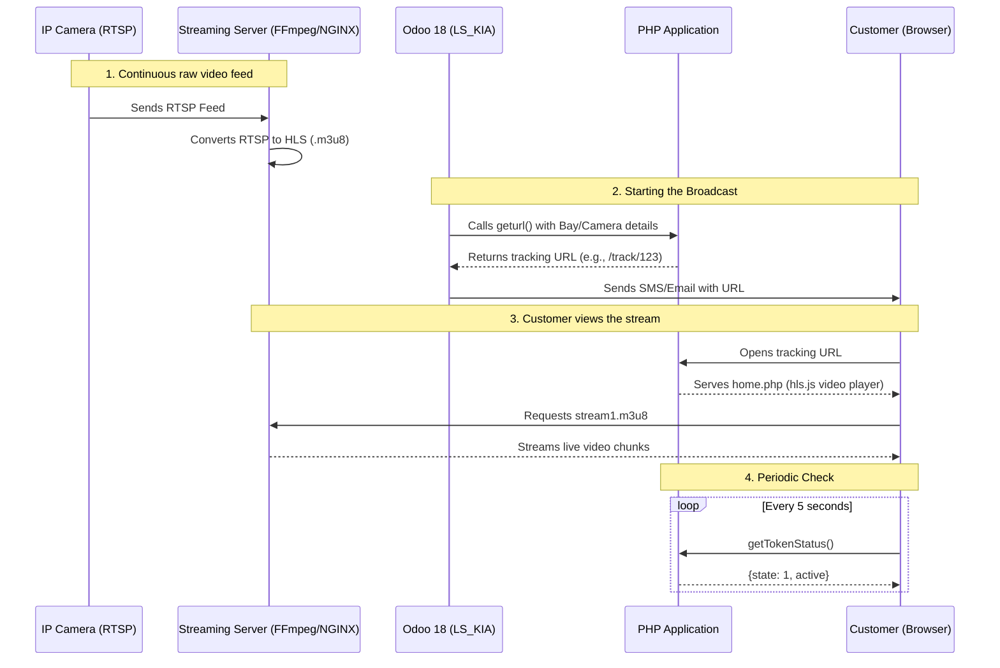

# Live Streaming Architecture (PHP Application)

## Why the PHP Code is Being Used
The PHP code (built on the CodeIgniter framework) is a lightweight, dedicated front-end application designed to handle the **customer-facing live video player**. 
Instead of rendering the video directly inside the complex Odoo UI (which can be heavy and requires authentication), this dedicated PHP portal serves a responsive, mobile-friendly, and public-facing webpage. It utilizes **HLS (HTTP Live Streaming)** technology to play the camera feeds seamlessly on any customer device.

## What Each PHP File/Function Does
1. `Pages.php` (Controller): The brain of the application. 
   - `geturl()`: An API endpoint called by Odoo. It receives camera details (IPs, credentials) and bay info, saves them in its own MySQL database (`camera_db`), generates a unique tracking `token`, and returns a tracking URL.
   - `track()`: The webpage endpoint. It takes the `token` from the URL, fetches the corresponding bay info from the database, and loads the HTML view for the customer.
   - `stop()`: Marks the stream as stopped or deletes the access token.
   - `getTokenStatus()`: An API called by the frontend periodically to check if the stream is still active.
2. `Manage_cam_acess_model.php` (Model): Handles all database operations with `camera_db`. It inserts new vehicle stream records, retrieves dealership details, and updates token status.
3. `home.php` (View): The actual HTML user interface that the customer sees. It includes the HTML5 `video` tags and uses a JavaScript library called `hls.js` to play the live `.m3u8` video streams.

## How the PHP Application Works & Handles Live Streaming
- **Receiving Data:** When a stream starts, the Odoo backend makes a request to the PHP `geturl()` API, sending camera and bay details. The PHP app generates a token and returns a tracking link.
- **Serving the Stream:** The customer opens the tracking link (`/track/[token]`). The PHP `home.php` view loads.
- **HLS Playback:** The page uses `hls.js`. It points the video player to a specific URL on the media server (e.g., `http://[cam_server]/[dir_name]/[bay_name]/stream1.m3u8`). The media server provides a continuous playlist of video chunks converted from the camera's RTSP feed.
- **Liveness Check:** The webpage runs a JavaScript timer that pings `getTokenStatus()` every 5 seconds. If the Odoo backend has ended the stream, the token becomes inactive, and the page automatically refreshes to show a "Live Streaming Completed" message.

## What Data it Receives and Returns
- **Receives (from Odoo):** Camera IP addresses, usernames, passwords, customer name, company name, bay name.
- **Returns (to Odoo):** A unique tracking token and the final formatted URL to access the stream (e.g., `http://server/camera/index.php/track/TOKEN123`).

## How it Communicates with the Camera/Streaming Service
The PHP application **does not** communicate directly with the IP cameras. 
Instead, there is a middleman "Streaming Service" (like an NGINX RTMP module or FFmpeg server) that pulls the raw RTSP feed from the cameras and converts it into HLS (`.m3u8` and `.ts` files). 
The PHP application simply acts as a **video player**, downloading these converted `.m3u8` files from the Streaming Service and playing them in the browser.

## Integration with LS_KIA (Odoo 18)
Yes, it can be connected seamlessly with your new project! 
**What changes are needed in LS_KIA:**
1. **API Triggering:** When a user clicks "Start Broadcast" in the Bay Planner (or backend), Odoo needs to make an HTTP GET/POST request to the PHP app's `geturl()` endpoint to register the stream and get the URL.
2. **Token Management:** Odoo should store the returned URL in the `ac.ars.live.stream.token` record. 
3. **SMS/Email:** Odoo uses this URL to send SMS or Email notifications to the customer.
4. **Stopping the Stream:** When the stream is stopped in Odoo, Odoo should call the PHP `stop()` or simply update the token status so the PHP app knows the stream ended.

## End-to-End Architecture Flow

